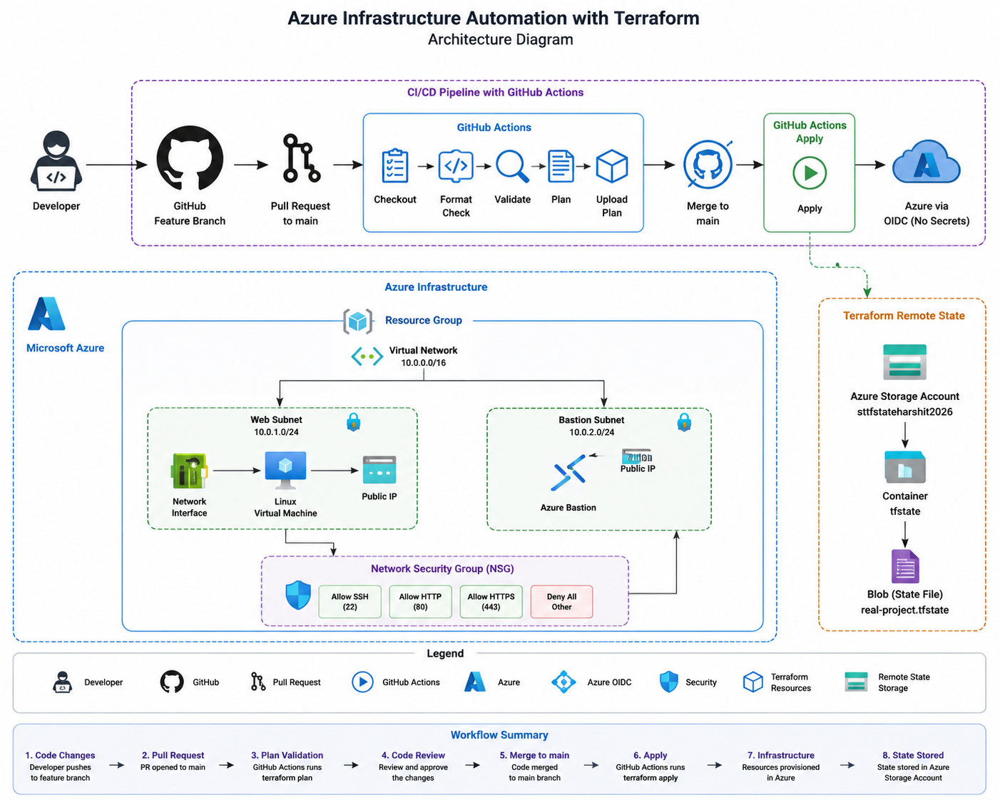

# Azure Infrastructure Automation with Terraform

## Project Overview

This project demonstrates the automated provisioning and management of Microsoft Azure infrastructure using Terraform, with a modular architecture and GitHub Actions based CI/CD pipeline.

The project implements:

- Modular Terraform infrastructure
- Azure Resource Group
- Azure Virtual Network and subnets
- Network Security Group and security rules
- Linux Virtual Machine
- Network Interface and Public IP
- Azure Bastion
- SSH key generation
- Azure Storage Account based remote Terraform state
- Azure AD authentication for the Terraform backend
- GitHub Actions CI/CD
- Azure OIDC authentication for GitHub Actions
- Automated Terraform Plan for Pull Requests
- Automated Terraform Apply after merging to main

---

## Architecture

```text
                         Developer
                             |
                             v
                     GitHub Feature Branch
                             |
                             v
                       Pull Request
                             |
                             v
                    GitHub Actions CI
                             |
                  +----------+----------+
                  |                     |
             Terraform fmt        Terraform validate
                  |                     |
                  +----------+----------+
                             |
                             v
                     Terraform Plan
                             |
                             v
                        PR Review
                             |
                             v
                       Merge to main
                             |
                             v
                    GitHub Actions CD
                             |
                             v
                       Azure OIDC
                             |
                             v
                     Terraform Apply
                             |
                             v
                    Microsoft Azure
                             |
              +--------------+--------------+
              |              |              |
              v              v              v
        Resource Group      VNet           NSG
                             |
                    +--------+--------+
                    |                 |
                    v                 v
               Web Subnet       Bastion Subnet
                    |                 |
                    v                 v
               Linux VM           Azure Bastion
                    |
                    v
              Network Interface
                    |
                    v
                Public IP


              Terraform Remote State
                       |
                       v
              Azure Storage Account
                       |
                       v
                  tfstate

